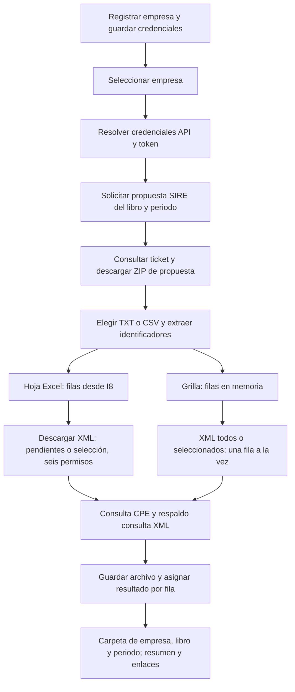
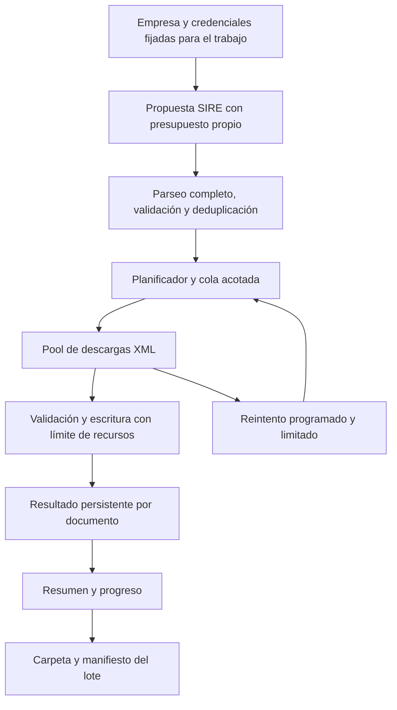

# Informe técnico: atasco en la descarga masiva de XML SIRE / SUNAT

**Fecha:** 14 de septiembre de 2026.  
**Alcance:** auditoría del código actual y propuesta de arquitectura, exclusivamente para obtener XML desde el registro de empresa hasta su entrega; no se modificó la implementación.  
**Síntoma confirmado por el usuario:** ocurre descargando únicamente XML, alrededor del 50–70 % del lote, y puede prolongarse durante horas.

**Secuencia de referencia confirmada:** primero se extrae la propuesta SIRE y después se pulsa «Descargar XML» en la macro. La ampliación identifica las dos rutas de interfaz presentes en el original; esa descripción por sí sola no distingue cuál produjo los 30–35 s.

## Conclusión ejecutiva

**La hipótesis principal es la ocupación prolongada de los seis trabajadores por peticiones lentas y reintentos, amplificada por la falta de un presupuesto temporal por XML y por lote.** El código permite explicar horas de procesamiento sin necesitar una fuga de conexiones ni un deadlock.

Hay que separar dos niveles:

1. **Mecanismo amplificador demostrado en el código:** cinco intentos por XML, hasta dos peticiones secuenciales en cada intento, 30 segundos por petición, esperas dentro del trabajador y ausencia de límite temporal del lote.
2. **Desencadenante pendiente de demostrar:** por qué las peticiones empiezan a consumir esos tiempos en Go. Puede ser degradación del servicio, limitación remota, establecimiento/reutilización de conexiones, diferencias de protocolo/proxy, autenticación o I/O local.

**No se ha demostrado una causa raíz única en ejecución.** No se obtuvo una captura del proceso durante el atasco ni una traza de la misma descarga en Excel. Los tiempos de referencia de la macro proceden del usuario.

También se confirmó un defecto de observabilidad: los resultados XML se registran por una ruta que puede omitir los mensajes individuales del log y dejar la velocidad sin actualizar.

### Base de evidencia

Se inspeccionaron el módulo `appsire-go` y el original descompilado en `decompiled`. La implementación de Excel encontrada es **C# / VSTO**, aunque el proceso se denomine “macro VBA”.

**Sí se analizó el original de la ruta indicada:** se leyó su código ya descompilado. No se realizó una nueva descompilación ni se ejecutó Excel para reproducir el lote. La primera comparación detallaba principalmente `DescargaXmlService`, correspondiente a las hojas; esta ampliación incorpora registro de empresa, credenciales y el recorrido de `FrmSirePropuestaGrid`. Se corrige la afirmación general de seis trabajadores: es cierta para la ruta de hojas, mientras la grilla descarga secuencialmente.

El ejecutable local `appsire-server.exe` declara Go 1.26.6 y `vcs.modified=true`. Su SHA-256 es:

`FA9214CE44E62311C15E5ADBF1D2E6753948AD8EBB5C5CAF566FE8AC24EA59CD`

Hay modificaciones previas sin confirmar en Git. Este informe describe el árbol de trabajo leído; la información de compilación no demuestra por sí sola que sea exactamente el binario del incidente.

## Recorrido de punta a punta

| Etapa | Flujo encontrado | Evaluación |
|---|---|---|
| Empresa | SQLite → descifrado de credenciales → OAuth → selección de empresa. El handler tiene 35 s y el cliente OAuth 30 s. | Existe control temporal, pero el proveedor de token es global y mutable. |
| Propuesta SIRE | Solicitud de ticket → consulta de estados → posible reutilización → descarga del ZIP → guardado → vista previa. | El handler limita la fase HTTP a 4 min; el cliente SIRE tiene 5 min por petición. El límite menor del contexto prevalece en red. |
| Metadatos | ZIP → TXT/CSV → detección de codificación/separador → mapeo RCE/RVIE → interfaz → lista enviada al motor. | RCE usa proveedor y libro 2; RVIE usa emisor y libro 1. La interfaz reconstruye la lista de descarga. |
| XML | Preflight → cola → seis trabajadores → principal/respaldo → validación/extracción → escritura → progreso. | Los reintentos retienen al trabajador y el tiempo total por documento no está limitado. |
| Entrega | Carpetas CPE, XML y ZIP original cuando corresponde; estado/resultados en memoria; SSE y polling; ZIP general bajo demanda. | No hay manifiesto persistente de resultados del lote. El ZIP general recorre toda la carpeta base. |

### Contrato SIRE y XML conservado

- OAuth utiliza `grant_type=password`, usuario RUC + Usuario SOL y scope `https://api-cpe.sunat.gob.pe/`, coincidente con el original.
- RCE: `exportacioncomprobantepropuesta?codTipoArchivo=0&codOrigenEnvio=2`; RVIE: `exportapropuesta?codTipoArchivo=0`.
- Polling: 15 consultas para RCE y 25 para RVIE, con pausas de 2 s. Cada consulta también puede reintentar; esos números no equivalen a un plazo total de 30 o 50 s.
- Selección de archivo: preferencia por ZIP cuyo nombre no contiene PCW; compatibilidad con `codTipoArchivoReporte` y la variante `codTipoAchivoReporte`; código de proceso 10.
- XML principal: `consultacpe/comprobantes/{ruc}-{tipoConsulta}-{serie}-{numero}-{libro}/02`.
- Respaldo: `controlcpe/consultaxml/{ruc}-{tipoOriginal}-{serie}-{numero}`.
- Las notas usan F7/B7/F8/B8 en consulta y 07/08 en respaldo.
- La propuesta se guarda bajo `APP DESCARGAS/SIRE/{RUC}/{RCE|RVIE}/{periodo}`.
- Los comprobantes se guardan bajo `APP DESCARGAS/CPE/{RUC empresa} {razón social}/{Compras|Ventas}/{periodo}`.

La reutilización de propuestas, el mapeo y la selección de archivos deben conservarse explícitamente en la siguiente fase. La función que busca la propuesta “última” toma el primer candidato elegible recibido: el orden temporal debe verificarse en la evidencia del servidor, no deducirse del nombre de la función. [E5, E6, E9]

## Flujo XML detallado: registro de empresa → entrega

El ZIP de **propuesta SIRE** contiene el listado de comprobantes del que se extraen sus identificadores. El **XML de cada comprobante** se obtiene después mediante peticiones CPE individuales, que también pueden entregar un ZIP. Descargar la propuesta no significa haber descargado los XML.



El diagrama representa el original descompilado. A continuación se contrasta cada etapa con Go.

### F1. Registrar la empresa

**Original.** `FrmAgregarEmpresa.btnGuardar_Click` exige nombre y RUC no vacíos; construye `EmpresaCredenciales` y lo guarda mediante `AccessRepository.InsertEmpresa` o `UpdateEmpresa`. Se almacenan RUC, razón social, usuario/clave SOL y credenciales API, además de otros campos administrativos. El alta no realiza OAuth y permite que las credenciales API estén incompletas. La ventana de selección recarga la lista después de guardar.

**Go.** La interfaz envía la empresa al endpoint de compañías; `Store.Save` valida y guarda en SQLite, protegiendo los secretos mediante cifrado. El alta exige RUC de once dígitos, razón social, usuario y clave SOL, Client ID y Client Secret. Guardar tampoco equivale a autenticarse: la selección/conexión es un paso posterior.

**Diferencia funcional:** el original permite registrar primero y completar API después; Go exige API desde el alta. Esto puede impedir iniciar el recorrido de una empresa que sí se podría registrar en la macro. No explica por sí mismo una descarga que ya llegó al 50–70 %.

Evidencia: [alta original](C:/Users/USER/AppData/Local/Programs/AppSireCPE/decompiled/AppSireCPE/FrmAgregarEmpresa.cs:196), [persistencia Access](C:/Users/USER/AppData/Local/Programs/AppSireCPE/decompiled/AppSireCPE.Data/AccessRepository.cs:67), [guardado Go](C:/Users/USER/AppData/Local/Programs/AppSireCPE/appsire-go/internal/company/store.go:209), [validaciones Go](C:/Users/USER/AppData/Local/Programs/AppSireCPE/appsire-go/internal/company/store.go:413).

### F2. Seleccionar y fijar el contexto de empresa

**Original.** `FrmSeleccionEmpresa.SeleccionarFilaActual` obtiene la empresa por ID, escribe nombre en `E1` y RUC en `E2` de `cpe` y `rvie`, y asigna `EmpresaContext.EmpresaActual`. Esta función no pide un token. Las ventanas de propuesta reciben una empresa; la grilla conserva `_empresa`. La descarga desde hoja vuelve a leer el RUC propietario de `E2`, nombre de `E1` y periodo de `K6`.

**Go.** `HandleCompanySelect` carga y descifra credenciales, solicita un token y después guarda la selección. Si OAuth falla, devuelve error. Tiene contexto de 35 s. El servicio de token es compartido; `HandleCompanyToken` también puede reemplazar sus credenciales sin pasar por el guardado de selección.

**Hallazgo:** empresa marcada en la interfaz, empresa seleccionada en almacenamiento y credenciales activas del proveedor no constituyen hoy una identidad inmutable del trabajo. Deben fijarse juntas antes de consultar la propuesta y conservarse hasta la entrega. El original también tiene estado global y celdas editables; no debe asumirse aislamiento perfecto por ser una aplicación de escritorio.

Evidencia: [selección original](C:/Users/USER/AppData/Local/Programs/AppSireCPE/decompiled/AppSireCPE/FrmSeleccionEmpresa.cs:964), [lectura del contexto de hoja](C:/Users/USER/AppData/Local/Programs/AppSireCPE/decompiled/AppSireCPE/DescargaXmlService.cs:77), [selección Go](C:/Users/USER/AppData/Local/Programs/AppSireCPE/appsire-go/internal/api/companies.go:91), [generación independiente de token](C:/Users/USER/AppData/Local/Programs/AppSireCPE/appsire-go/internal/api/companies.go:133).

### F3. Obtener credenciales API y autenticar para XML

**Original.** Antes de generar el token, `CredencialesApiAuto.Asegurar` comprueba `ClientId/ClientSecret`. Si faltan y existen credenciales SOL, intenta iniciar sesión SOL, consultar las credenciales API y otorgar los permisos asociados a la aplicación. Persiste lo recuperado en Access. Si no obtiene el secreto, informa que hace falta completarlo; no garantiza poder recuperarlo. Además recuerda los intentos fallidos por RUC durante la sesión para evitar repetirlos continuamente.

`TokenManager` utiliza **ClientId y ClientSecret**, junto con RUC + Usuario SOL y clave SOL. El formulario denomina al otro par, `CpeClientId/CpeClientSecret`, «Api ID Validación» y «Api Clave Validación»: no son los campos que alimentan esta cadena de descarga XML.

El token se obtiene de `https://api-seguridad.sunat.gob.pe/v1/clientessol/{clientId}/oauth2/token/`, con `grant_type=password` y scope `https://api-cpe.sunat.gob.pe/`. `HojaTk.GuardarToken` delega actualmente en `TokenStore`: la caché usada por esta ruta es en memoria y por RUC. `TokenCpe` comprueba si sigue siendo utilizable y renueva cuando corresponde; también contempla otorgar permisos y volver a generar el token ante ciertos errores.

**Go.** Consume las credenciales principales ya guardadas y reproduce el contrato OAuth. En la cadena de alta/conexión auditada no aparece el equivalente a recuperar automáticamente Client ID/Secret desde SOL. Su caché y refresh pertenecen a un proveedor global mutable.

**Implicación:** antes de atribuir diferencias a `net/http`, hay que contrastar credenciales principales, RUC, scope y permisos efectivos. El nombre de un campo que contiene «CPE» no demuestra que ese sea el par usado para descargar XML.

Evidencia: [resolución automática](C:/Users/USER/AppData/Local/Programs/AppSireCPE/decompiled/AppSireCPE.SIRE/CredencialesApiAuto.cs:31), [consulta SOL y permisos](C:/Users/USER/AppData/Local/Programs/AppSireCPE/decompiled/AppSireCPE.SIRE/CredencialesApiAuto.cs:143), [TokenManager](C:/Users/USER/AppData/Local/Programs/AppSireCPE/decompiled/AppSireCPE.SIRE/TokenManager.cs:8), [TokenCpe](C:/Users/USER/AppData/Local/Programs/AppSireCPE/decompiled/AppSireCPE.SIRE/TokenCpe.cs:15), [etiquetas del formulario](C:/Users/USER/AppData/Local/Programs/AppSireCPE/decompiled/AppSireCPE/FrmAgregarEmpresa.cs:428), [credenciales Go](C:/Users/USER/AppData/Local/Programs/AppSireCPE/appsire-go/internal/company/store.go:301).

### F4. Extraer la propuesta SIRE

**Entrada:** empresa autenticada, libro RCE o RVIE y periodo `AAAAMM`.

**Original, ruta de hoja.** `FrmSirePropuesta.btnDescargar_Click` genera el token para `_empresa`, prepara la hoja y llama a `EjecutarPropuestaRceAsync` o `EjecutarPropuestaRvieAsync`. El volcado empieza en fila 8, columna 9: `I8`.

**Original, ruta de grilla.** `FrmSirePropuestaGrid` asegura su token y llama a `DescargarPropuestaRceFilasAsync` o `DescargarPropuestaRvieFilasAsync`. Recibe filas en memoria y las muestra; no necesita que hayan sido volcadas previamente a Excel.

En ambas rutas, el servicio solicita ticket, consulta estados, localiza el reporte y descarga el ZIP. El polling tiene 15 consultas para RCE y 25 para RVIE, con pausas de 2 s. Si no termina, busca una propuesta previa y requiere la aceptación que solicita la propia macro antes de reutilizarla. El servicio prepara una carpeta temporal bajo `%TEMP%/SireCPE`.

**Go.** `HandleDownloadSireProposal` recibe libro, periodo y opción de reutilización, con límite de 4 min. Descarga el ZIP, lo guarda bajo `APP DESCARGAS/SIRE/{RUC}/{RCE|RVIE}/{periodo}` y genera la vista previa. El request no incluye una identidad propia de empresa; utiliza el proveedor compartido, y lee sus credenciales nuevamente al decidir la carpeta de guardado.

**Salida que debe conservarse:** asociación empresa–libro–periodo–ticket–archivo de propuesta. Si se reutiliza un ticket anterior, debe quedar explícito en el resultado. Los fallos de esta etapa impiden construir el lote XML; no son fallos de un comprobante individual.

Evidencia: [propuesta hacia hoja](C:/Users/USER/AppData/Local/Programs/AppSireCPE/decompiled/AppSireCPE/FrmSirePropuesta.cs:234), [propuesta hacia grilla](C:/Users/USER/AppData/Local/Programs/AppSireCPE/decompiled/AppSireCPE/FrmSirePropuestaGrid.cs:1101), [servicio RCE/RVIE de grilla](C:/Users/USER/AppData/Local/Programs/AppSireCPE/decompiled/AppSireCPE/SirePropuestaService.cs:627), [handler Go](C:/Users/USER/AppData/Local/Programs/AppSireCPE/appsire-go/internal/api/handlers.go:210).

### F5. Elegir los datos y extraer los identificadores XML

**Original.** Abre el ZIP de propuesta, busca TXT/CSV y selecciona el archivo de datos. Cuando hay varios, `ElegirArchivoDatos` puntúa el número de campos y penaliza nombres o contenido de reportes, inconsistencias, parámetros y observaciones. Después detecta codificación/separador y descarta encabezados. En la ruta de hoja se leen las celdas en bloque con `Value2` antes de distribuir las descargas.

**Go.** Abre el ZIP en memoria y ordena candidatos prefiriendo TXT sobre CSV y después nombre alfabético. Lee hasta 64 MiB, interpreta texto y construye filas e identificadores. Limita también los documentos descargables a las primeras 1 000 filas, no solo la representación visual.

**Diferencia confirmada:** seleccionar el ZIP correcto del ticket no basta. Go puede escoger un TXT de reporte cuando el original habría elegido el archivo de comprobantes. Debe validarse el esquema del archivo interior antes de generar peticiones.

| Dato para descargar | RCE / Compras | RVIE / Ventas |
|---|---|---|
| RUC emisor, índice desde cero en fila SIRE | 12: documento del proveedor | 0: RUC de la empresa emisora |
| Tipo de comprobante | 6 | 6 |
| Serie | 7 | 7 |
| Número | 9 | 8 |
| Fecha de emisión | 4 | 4 |
| Columnas de hoja, con datos desde I8 | RUC U; tipo O; serie P; número R | RUC I; tipo O; serie P; número Q |
| Libro en consulta XML | `2` | `1` |
| Sufijo de consulta XML | `2/02` | `1/02` |
| Propietario de carpeta | Empresa seleccionada | Empresa seleccionada |

El RUC del proveedor identifica el XML de compras; el RUC de la empresa identifica al propietario de la descarga. Confundirlos construye peticiones o carpetas incorrectas. El tipo original debe conservarse para el respaldo, aunque el tipo de consulta se transforme a F7/B7/F8/B8 según la nota y la serie.

Evidencia: [selección de archivo interior original](C:/Users/USER/AppData/Local/Programs/AppSireCPE/decompiled/AppSireCPE/SirePropuestaService.cs:919), [mapa original](C:/Users/USER/AppData/Local/Programs/AppSireCPE/decompiled/AppSireCPE/SireLibroColumnas.cs:58), [parser Go](C:/Users/USER/AppData/Local/Programs/AppSireCPE/appsire-go/internal/sirepreview/preview.go:72), [mapa Go](C:/Users/USER/AppData/Local/Programs/AppSireCPE/appsire-go/internal/sirepreview/preview.go:165).

### F6. Pulsar «Descargar XML» y determinar el lote real

**Original, hoja.** El botón de la cinta termina en `DescargarXmlSmartAsync`. Decide entre selección explícita, reintento de filas con errores o descarga de pendientes. En la descarga ordinaria omite filas con enlace XML utilizable y reutiliza archivos encontrados mediante un índice de carpeta. La selección explícita evita esa reutilización inicial y permite volver a descargar las filas seleccionadas. Las filas sin identificadores necesarios no se convierten en trabajos.

**Original, grilla.** «XML sel.» envía las filas seleccionadas; «XML todos» pasa `_rows.ToList()` a `DescargaMasiva`. Esta ruta masiva no aplica el mismo índice de archivos de la hoja. El acceso individual a una fila sí puede abrir su XML ya descargado.

**Go.** `startProposalXmlDownload` toma los elementos de la tabla, aplica el filtro de búsqueda activo y reconstruye los comprobantes. Elimina filas sin serie o número antes de enviar el lote; si solo algunas son inválidas, no quedan representadas como errores del lote. Envía `tipos: ['XML']` y concurrencia seis. El periodo procede del selector editable en ese momento, y el propietario de los datos activos de interfaz. En compras, si falta el RUC del proveedor, lo sustituye por el RUC activo.

El handler vuelve a asignar `EmpresaRUC` desde las credenciales globales y, para ventas, también fuerza el RUC emisor. No verifica una asociación persistida con la propuesta de origen.

**Riesgo concreto, deducido del recorrido del código:** generar propuesta de A, seleccionar B y pulsar XML sin generar una propuesta nueva puede combinar filas antiguas con propietario/token de B. Cambiar solamente el selector de periodo también puede guardar documentos bajo un periodo distinto del que produjo la propuesta. La selección de empresa no limpia los arrays de propuesta en la interfaz auditada. Este escenario no se reprodujo en ejecución y no se atribuye al incidente reportado.

**Criterio necesario:** antes de iniciar, fijar empresa, libro, periodo y propuesta; informar cuántas filas hay, cuáles se excluyen por filtro, cuáles son inválidas y cuántos documentos únicos requieren red. «500 filas visibles» no demuestra «500 descargas nuevas».

Evidencia: [botón de cinta](C:/Users/USER/AppData/Local/Programs/AppSireCPE/decompiled/AppSireCPE/Ribbon1.cs:818), [decisión de pendientes/selección](C:/Users/USER/AppData/Local/Programs/AppSireCPE/decompiled/AppSireCPE/DescargaXmlService.cs:678), [botones de grilla](C:/Users/USER/AppData/Local/Programs/AppSireCPE/decompiled/AppSireCPE/FrmSirePropuestaGrid.cs:213), [selección de empresa en interfaz Go](C:/Users/USER/AppData/Local/Programs/AppSireCPE/appsire-go/web/static/app.js:663), [construcción del lote Go](C:/Users/USER/AppData/Local/Programs/AppSireCPE/appsire-go/web/static/app.js:1270), [asignación de empresa en backend](C:/Users/USER/AppData/Local/Programs/AppSireCPE/appsire-go/internal/api/handlers.go:379).

### F7. Distribuir las peticiones y recuperar fallos

**Original, hoja:** crea trabajos en memoria, inicia `Task.WhenAll` y limita las descargas con `SemaphoreSlim(6)`. Cada permiso permanece ocupado durante los reintentos de ese documento, hasta cinco intentos ante errores transitorios. El bloque `finally` incrementa el progreso y libera el permiso. Después de la pasada puede renovar el token una vez y recuperar las filas cuyo error indica expiración.

**Original, grilla:** `DescargaMasiva` usa un `for` con `await DescargarFilaConReintentos` dentro. **Procesa un comprobante a la vez.** Cada fila tiene hasta cinco intentos; al terminar la primera pasada renueva el token para las filas afectadas y contempla hasta tres barridos adicionales de errores transitorios. Espera 2,5 s entre barridos y deja de insistir si no disminuyen los pendientes. La cancelación se comprueba entre operaciones; no se pasa a la llamada COM síncrona ni a todos los `Task.Delay`.

**Go:** realiza una prueba de acceso con el primer documento. Un 401 activa renovación; un 403 del principal permite probar el respaldo. Un error documental o de transporte no concluyente no bloquea automáticamente el lote. Si ambos accesos siguen rechazando autenticación/permisos, finaliza con resultados de error. Después usa seis trabajadores y reintentos inmediatos por XML; recupera la cohorte de 401 tras renovar. **XML no entra en los barridos generales de transitorios** de `sweepTransientFailures`.

Por tanto, el original no implementa simplemente «un intento, ignorar y seguir»: ambas rutas tienen recuperación, pero con patrones distintos. Go ya limita la concurrencia; falta limitar el tiempo acumulado y evitar que los seis trabajadores permanezcan retenidos por documentos lentos. Las pruebas de acceso iniciales ocurren antes de procesar el lote y no explican por sí solas una meseta que empieza al 50–70 %.

Evidencia: [pool de hoja](C:/Users/USER/AppData/Local/Programs/AppSireCPE/decompiled/AppSireCPE/DescargaXmlService.cs:327), [reintentos de grilla](C:/Users/USER/AppData/Local/Programs/AppSireCPE/decompiled/AppSireCPE/FrmSirePropuestaGrid.cs:1483), [bucle secuencial y barridos](C:/Users/USER/AppData/Local/Programs/AppSireCPE/decompiled/AppSireCPE/FrmSirePropuestaGrid.cs:1599), [preflight Go](C:/Users/USER/AppData/Local/Programs/AppSireCPE/appsire-go/internal/engine/download_engine.go:301), [etapa XML Go](C:/Users/USER/AppData/Local/Programs/AppSireCPE/appsire-go/internal/engine/download_engine.go:428).

### F8. Obtener el archivo XML del comprobante

Las dos rutas del original llaman al mismo `SunatCpeXmlDownloader.DescargarXmlZipConFallback`:

1. **Principal:** GET a `https://api-cpe.sunat.gob.pe/v1/contribuyente/consultacpe/comprobantes/{rucEmisor}-{tipoConsulta}-{serie}-{numero}-{libro}/02`, con el token.
2. Si responde correctamente, interpreta `nomArchivo` y `valArchivo`, decodifica Base64 y escribe el archivo recibido con extensión ZIP.
3. Si falla, prueba GET a `https://api-cpe.sunat.gob.pe/v1/contribuyente/controlcpe/consultaxml/{rucEmisor}-{tipoOriginal}-{serie}-{numero}`. Espera bytes de ZIP y asigna un nombre con la identidad del comprobante.
4. Si fallan ambos, conserva un error que permita clasificar recuperación; no se considera que HTTP 200 garantice contenido correcto.

**Diferencia de validación:** el principal original comprueba que Base64 pueda decodificarse y que haya al menos cuatro bytes; el respaldo además comprueba el prefijo `PK`. No valida allí la estructura interna completa ni extrae el XML. Go inspecciona la respuesta, intenta extraer el XML del ZIP, valida contenido y obtiene el digest cuando dispone del XML; conserva también el ZIP original cuando corresponde.

**Consecuencia para comparar tiempos y éxito:** la ruta ordinaria de la macro entrega habitualmente el ZIP que contiene el XML, aunque la acción se llame «XML». Go realiza trabajo adicional y su aceptación del archivo puede ser distinta. La comparación debe contar XML utilizables con el mismo criterio, además de medir ZIP recibidos.

Evidencia: [principal y respaldo original](C:/Users/USER/AppData/Local/Programs/AppSireCPE/decompiled/AppSireCPE/SunatCpeXmlDownloader.cs:10), [HTTP original](C:/Users/USER/AppData/Local/Programs/AppSireCPE/decompiled/AppSireCPE/SunatHttp.cs:30), [descarga Go](C:/Users/USER/AppData/Local/Programs/AppSireCPE/appsire-go/internal/sunat/downloader_xml.go:12), [validación y digest Go](C:/Users/USER/AppData/Local/Programs/AppSireCPE/appsire-go/internal/engine/download_engine.go:878).

### F9. Crear carpetas, reutilizar y almacenar

El destino lógico de comprobantes es:

```text
APP DESCARGAS/
  CPE/
    {RUC propietario} {razón social}/
      Compras/ o Ventas/
        {AAAAMM}/
          archivos de comprobantes
```

**Original.** `GestorRutasDescarga` conserva la carpeta base elegida. Se prepara el destino de empresa/libro/periodo, el descargador escribe inicialmente en la raíz configurada y el servicio mueve el ZIP al destino. Si ya existe un archivo con el mismo nombre, puede borrarlo antes de mover. En la grilla, `MoverACarpeta` captura el error y devuelve la ruta original: puede informar descarga exitosa aunque el archivo no haya llegado a la carpeta esperada.

La ruta de hoja recorta previamente la razón social a 30 caracteres; el constructor general permite hasta 60. El índice reutiliza ZIP/XML por identidad normalizada del comprobante. Esto afecta tanto al tiempo medido como a la localización de archivos existentes.

**Go.** Construye la carpeta con el propietario y periodo del comprobante, llama a `MkdirAll`, escribe contenido y, cuando corresponde, escribe también el ZIP original. No aplica el mismo recorte de razón social. Antes de descargar consulta el índice de archivos existentes y puede devolver éxito sin red. El índice se prepara bajo un mutex compartido; las escrituras no usan un temporal seguido de renombrado. Un fallo al conservar el ZIP puede dejar el XML escrito pero el documento marcado como error.

**Implicación:** conservar solo el aspecto de la ruta no asegura paridad. Deben verificarse nombre normalizado de carpeta, archivos previos, duplicados, éxito de traslado y significado de reutilización. El destino final debe quedar registrado por documento, no inferido únicamente de la carpeta base.

Evidencia: [gestor original](C:/Users/USER/AppData/Local/Programs/AppSireCPE/decompiled/AppSireCPE/GestorRutasDescarga.cs), [recorte y carpeta de hoja](C:/Users/USER/AppData/Local/Programs/AppSireCPE/decompiled/AppSireCPE/DescargaXmlService.cs:107), [traslado en grilla](C:/Users/USER/AppData/Local/Programs/AppSireCPE/decompiled/AppSireCPE/FrmSirePropuestaGrid.cs:1542), [escritura Go](C:/Users/USER/AppData/Local/Programs/AppSireCPE/appsire-go/internal/filemanager/organizer.go:101), [reutilización Go](C:/Users/USER/AppData/Local/Programs/AppSireCPE/appsire-go/internal/engine/download_engine.go:841).

### F10. Entregar archivos y consolidar el resumen

**Original, hoja.** Al cerrar la pasada escribe resultados por fila: enlace «Ver XML» en la columna E o error/comentario. Presenta conteos y ofrece abrir la carpeta. Los reutilizados por índice pueden integrar los resultados; las filas omitidas previamente no equivalen a peticiones de red. El progreso de los trabajos pendientes y el total de resultados reutilizados/descargados no usan necesariamente el mismo denominador.

**Original, grilla.** Actualiza la ruta XML y el estado de cada fila; presenta éxitos/errores y ofrece abrir la carpeta. La ruta del archivo permite abrirlo desde la tabla. Los contadores se ajustan si una recuperación posterior tiene éxito.

**Go.** El trabajador publica el resultado; el servidor mantiene estado en memoria y la interfaz recibe actualizaciones mediante SSE y polling. El cierre calcula el resumen y permite abrir la carpeta. El endpoint de ZIP general recorre la base de descargas; no obtiene su contenido de un manifiesto del lote actual. No existe todavía un resumen durable que permita reconstruir de forma inequívoca el lote después de reiniciar el proceso.

**Defecto conectado con el síntoma:** la ruta XML puede haber incorporado ya un resultado durante el progreso y luego salir anticipadamente de `recordFinalResult`, omitiendo log individual y cálculo de velocidad. Un indicador que no cambia no demuestra que la red esté bloqueada. Hay que cotejar contador de resultados, archivos escritos y estado de los trabajadores.

**Contrato de entrega propuesto para la fase de implementación:** carpeta del lote, XML utilizables, ZIP originales cuando corresponda y manifiesto por documento con estado, error, intentos y ruta. El resumen debe distinguir nuevas descargas, reutilizados, inválidos, fallidos y pendientes; todos los documentos de entrada deben quedar contabilizados. Un fallo aislado permite continuar; una falla global de autenticación o almacenamiento debe producir un cierre explícito con lo ya recuperado.

Evidencia: [resultados en hoja](C:/Users/USER/AppData/Local/Programs/AppSireCPE/decompiled/AppSireCPE/DescargaXmlService.cs:290), [resumen en grilla](C:/Users/USER/AppData/Local/Programs/AppSireCPE/decompiled/AppSireCPE/FrmSirePropuestaGrid.cs:1742), [resultados Go](C:/Users/USER/AppData/Local/Programs/AppSireCPE/appsire-go/internal/engine/download_engine.go:696), [cierre Go](C:/Users/USER/AppData/Local/Programs/AppSireCPE/appsire-go/internal/engine/download_engine.go:795), [entrega ZIP Go](C:/Users/USER/AppData/Local/Programs/AppSireCPE/appsire-go/internal/api/handlers.go:510).

### Diferencias que deben resolverse antes de portar el flujo como equivalente

| Diferencia comprobada | Efecto posible | Relación con el atasco |
|---|---|---|
| Alta y recuperación automática de credenciales distintas | Una empresa registrable en el original no llega al mismo punto en Go | Afecta entrada/autenticación; no prueba la meseta |
| Propuesta sin vínculo inmutable con empresa/periodo en Go | Peticiones con identidad mezclada o entrega en carpeta equivocada | Puede generar errores; requiere correlación temporal |
| Selección distinta del TXT/CSV interior | Metadatos incorrectos y documentos omitidos | Problema de integridad, no evidencia de deadlock |
| Dos rutas XML originales con concurrencia distinta | Comparación de rendimiento ambigua | Necesario identificar el recorrido medido |
| Filtros, archivos previos y filas excluidas | Diferente número de peticiones reales | Puede explicar parte de la diferencia de tiempos |
| ZIP guardado frente a extracción/inspección XML | Diferente trabajo por comprobante y criterio de éxito | Medir red, CPU y disco por separado |
| Recuperación y seguimiento distintos | Retención de trabajadores y actividad poco visible | Relación directa con la hipótesis principal |

Ninguna de estas diferencias autoriza a afirmar que SUNAT esté aplicando throttling o que exista una fuga: esas causas necesitan evidencia durante la ejecución.

## 1. Diagnóstico del atasco: causas potenciales

### 1.1. Prioridad alta: trabajadores retenidos por reintentos

En el flujo XML actual:

1. `runBatch` limita la concurrencia efectiva a seis.
2. `downloadSingleItem` ejecuta el intento.
3. `DownloadXML` puede llamar al principal y después al respaldo.
4. `downloadXMLWithImmediateRetries` conserva el documento hasta completar un máximo de cinco intentos.
5. Solo después se publica su progreso y el trabajador toma otro documento.
6. El recolector espera hasta que terminen todos los trabajadores.

**Cálculo ilustrativo, suponiendo token disponible y ambas peticiones agotando 30 s:**

- Un intento lógico: hasta 30 + 30 = 60 s de HTTP.
- Cinco intentos: hasta 300 s.
- Cuatro pausas: como máximo 0,5 + 1 + 2 + 4 = 7,5 s.
- Un XML lento: aproximadamente **307,5 s**, sin contar autenticación, CPU ni disco.

Si ya terminaron 300 de 500 y quedan 200 documentos con ese comportamiento:

**ceil(200 / 6) × 307,5 s = 10 455 s ≈ 174 minutos.**

Si únicamente se usa el respaldo: **ceil(200 / 6) × 157,5 s ≈ 89 minutos.**

Es un modelo de escenario, no una medición ni un límite absoluto de toda la función. Una renovación de token u operación de disco puede añadir tiempo.

**Distinción diagnóstica:** este mecanismo explica horas para terminar el remanente, con avances pequeños entre grupos. Si el contador exacto de procesados permanece idéntico durante horas, la explicación queda incompleta: habrá que buscar I/O fuera de los plazos HTTP, espera de sincronización, pérdida del seguimiento o diferencias de binario.

En XML no corresponde atribuir 5 × 5 reintentos internos/externos: actualmente usa `doRequestOnce` y omite los barridos transitorios de PDF/CDR. Puede haber una segunda cohorte por 401. [E1, E2, E3]

### 1.2. Contextos y timeouts: existen, pero no abarcan la unidad de trabajo

El cliente CPE configura:

| Parámetro actual | Valor |
|---|---:|
| Timeout HTTP en el arranque | 30 s |
| Dial TCP | 8 s |
| Negociación TLS | 10 s |
| Conexiones máximas por host | 6 |
| Conexiones inactivas por host | 6 |
| Conexiones inactivas totales | 12 |
| Expiración de conexión inactiva | 90 s |
| Diales simultáneos | 2 |

No hay `ResponseHeaderTimeout` específico. Eso **no vuelve ilimitada la petición**, porque `http.Client.Timeout` abarca conexión, redirecciones y lectura del cuerpo. `IdleConnTimeout` solo afecta conexiones inactivas; `MaxConnsPerHost` limita conexiones, no peticiones por segundo. [Documentación de net/http, Go 1.26.6](https://pkg.go.dev/net/http@go1.26.6#Client).

La carencia concreta está en el presupuesto envolvente:

- El lote nace con `context.WithCancel(context.Background())`: cancelable, sin fecha límite.
- Todos los intentos reutilizan ese contexto.
- Obtener el token ocurre antes de `httpClient.Do`.
- Los reintentos, el parseo y el guardado no están sujetos a los 30 s del cliente CPE.
- La descarga individual desde otro handler tiene 2 min, pero ese plazo no se aplica al motor masivo.

Añadir un contexto individual solo ayudará si engloba **token + esperas + principal + respaldo + reintentos**, se propaga y sus consumidores atienden la cancelación. Un contexto tampoco interrumpe automáticamente una llamada bloqueada a `os.WriteFile`. [E1, E2, E3, E4, E7]

### 1.3. Fugas de sockets y transporte

**No se encontró un camino ordinario que olvide cerrar el cuerpo HTTP en CPE, SIRE u OAuth.**

CPE y SIRE leen el cuerpo y lo cierran antes de evaluar el estado o reintentar. OAuth usa cierre diferido. Se reutiliza un cliente CPE compartido; no se crea un transporte por XML.

La hipótesis de fuga por `resp.Body` abierto tiene, por tanto, menor respaldo que la acumulación de latencia. Aun así, falta verificar recursos en ejecución:

- Evolución de conexiones activas, SYN_SENT, CLOSE_WAIT y TIME_WAIT.
- Reutilización real y protocolo negociado.
- Tiempo en DNS, dial, TLS, espera de conexión, primera respuesta y lectura.
- Comportamiento después de que SUNAT cierre conexiones persistentes.

TIME_WAIT por sí solo no demuestra una fuga. Los comentarios que mencionan SYN_SENT en el código son una intención de diseño, no una captura de red.

`ForceAttemptHTTP2=true` permite intentar HTTP/2; no prueba que SUNAT lo negocie. Los dos permisos de dial limitan conexiones nuevas, no todos los intercambios HTTP. Podrían alargar el restablecimiento de conectividad bajo fallos, pero no muestran un deadlock estático. [E2]

### 1.4. Canales, WaitGroup y mutexes

**No aparece un deadlock evidente por cierre de canales o ausencia de Done.**

- La cola de trabajo se llena y cierra por el productor.
- Los canales de trabajo y resultados tienen capacidad igual al número de documentos.
- Cada documento genera un resultado en esa pasada.
- Cada trabajador hace `defer group.Done()`.
- Una goroutine espera el grupo y cierra resultados.
- El emisor SSE usa envío no bloqueante; un navegador lento no debería detener las descargas.

Que `WaitGroup.Wait` esté esperando no lo convierte en la causa raíz: puede estar esperando correctamente a un trabajador detenido en red o disco.

Sí hay puntos de contención:

- `ensureDirectoryIndexed` mantiene un mutex global mientras ejecuta `ReadDir` y `entry.Info`. Una carpeta lenta puede detener consultas y actualizaciones del índice de otras carpetas.
- El estado recorre resultados y copia snapshots bajo mutex; el coste acumulado crece aproximadamente de forma cuadrática.
- `singleflight.Do` hace esperar a los seguidores del refresh; su espera no se cancela de forma individual por el contexto del seguidor.

Estos riesgos necesitan stacks o perfiles para elevarse a causas confirmadas. [E1, E4, E8]

### 1.5. Agotamiento de descriptores y memoria

Para un único lote de 500 XML no se observa concurrencia de red/disco sin límite: hay seis trabajadores. `os.WriteFile` no deja un archivo abierto tras retornar y los lectores ZIP revisados se cierran.

El `defer fsFile.Close()` del empaquetador está dentro del callback que procesa **un archivo**: no acumula todos los archivos abiertos hasta terminar el recorrido.

Los riesgos reales son otros:

- `io.ReadAll` sin límite en respuestas CPE/SIRE y en extracción de XML.
- Coexistencia en memoria de JSON, Base64, ZIP y XML descomprimido.
- Snapshots crecientes enviados por SSE y polling.
- Escrituras y metadatos del filesystem ejecutados dentro de los trabajadores.
- Descargas individuales, otros clientes HTTP o futuros lotes por empresa fuera de un presupuesto global de recursos.

En Windows deben medirse handles y sockets del proceso. No hay evidencia actual para diagnosticar “agotamiento de file descriptors”. [E2, E7, E8]

### 1.6. Throttling y reacción ante errores remotos

El cliente reconoce 408, 425, 429, 500, 502, 503 y 504 como transitorios. También detecta ciertas páginas HTML servidas con estado 200.

**La ruta XML no interpreta Retry-After**, ni reduce la concurrencia, ni pausa globalmente un endpoint degradado. Los trabajadores repiten sus intentos con jitter; el respaldo se consulta inmediatamente tras el fallo primario.

Esto puede mantener presión durante una limitación remota. Pero 429 rápidos, con cuerpos cortos, **no bastan por sí solos para explicar horas** con estos límites de intentos. Deben medirse los tiempos de respuesta y la clasificación real de cada fallo.

SIRE sí interpreta Retry-After numérico, aunque no la variante con fecha HTTP. La norma admite ambas formas. [RFC 9110, Retry-After](https://www.rfc-editor.org/rfc/rfc9110.html#name-retry-after).

Otra limitación es que la clasificación de varios errores depende de palabras como “timeout”, “zip” o “json”. Un error de escritura cuyo mensaje contenga un nombre ZIP puede terminar clasificado como transitorio de descarga. Conviene separar fallos de red, protocolo, datos, autorización y almacenamiento. [E2, E3, E5]

### 1.7. Progreso y resumen: defectos confirmados

**Error omitido en el log:** `recordStageProgress` inserta el resultado XML. Al finalizar la etapa, `recordFinalResult` encuentra esa misma clave y retorna antes de ejecutar `addLog`. El error puede existir en `Resultados` sin aparecer en los mensajes individuales del log.

**Velocidad inconsistente:** se actualiza en `recordFinalResult` después de la misma salida anticipada. En el camino normal XML puede permanecer en cero. `HilosActivos` tampoco es una medición de actividad real.

**Cancelación engañosa:** `finishBatch` fija 100 % y eleva `Procesados` al total aunque falten resultados. Puede producir discrepancias entre total, éxitos, errores y pendientes.

**Seguimiento silencioso:** el modal SIRE ya consulta cada 1,2 s además de SSE. Por tanto, la ausencia de polling no es la explicación actual. Sin embargo, las excepciones se silencian y las consultas no tienen un timeout explícito en el frontend. Una pérdida persistente del servidor puede dejar el modal abierto.

**Persistencia ausente:** resultados y hasta 500 mensajes se conservan en memoria; no hay un reporte durable por lote. El proceso además depende de un watchdog de escritorio que puede ejecutar `os.Exit` sin consolidar el trabajo. [E1, E7, E10]

### 1.8. Riesgos de empresa y metadatos

El proveedor de token es una única instancia global. Seleccionar o generar token de otra empresa puede reemplazar sus credenciales mientras un lote sigue descargando. El lote conserva identificadores/rutas, pero vuelve a consultar ese proveedor compartido para cada petición.

Esto permite contaminación lógica entre empresas sin requerir una data race. Asimismo, la propuesta consulta el RUC activo después de terminar la descarga para decidir dónde guardarla.

`ForceRefresh` llama a `singleflight.Forget`: bajo refrescos solapados pueden iniciarse nuevas solicitudes mientras otra sigue en curso. Esto contradice una garantía absoluta de refresh único. [Documentación de singleflight](https://pkg.go.dev/golang.org/x/sync/singleflight#Group.Forget).

No hay evidencia de que un cambio de empresa haya provocado este incidente.

Además, la vista previa limita tanto las filas mostradas como los documentos construidos a 1 000. No explica el atasco con 500, pero sí una futura descarga incompleta. El límite de 64 MiB del TXT tampoco comprueba explícitamente que exista contenido adicional. [E4, E6, E7]

La ampliación F1–F10 identifica otros puntos concretos: recuperación de credenciales API desde SOL presente en el original, selección distinta del TXT/CSV interior y posibilidad de reutilizar filas de una propuesta después de cambiar empresa o periodo en Go. Son diferencias del flujo que requieren resolución, aunque no se ha demostrado que causaran la meseta reportada.

## 2. Comparativa Macro vs. Go

| Aspecto | Original: hoja Excel | Original: grilla | Go actual |
|---|---|---|---|
| Implementación | C# / VSTO | C# / Windows Forms dentro del original | Go, net/http |
| Concurrencia XML | SemaphoreSlim(6) | Bucle secuencial con await por fila | Seis trabajadores efectivos |
| Recuperación transitoria | Hasta cinco intentos con jitter | Hasta cinco por fila y hasta tres barridos, con corte si no mejoran | Hasta cinco con jitter; XML excluido de barridos generales |
| Principal y respaldo | Consulta CPE → consulta XML | Mismo descargador que la hoja | Mismo orden general, condicionado por preflight |
| Fallo definitivo | Resultado y liberación del permiso | Resultado y avance a la siguiente fila | Resultado por documento tras sus intentos |
| Token | Por empresa/RUC; capturado para la pasada | Empresa de la ventana; capturado para la pasada | Proveedor global consultado por petición |
| Transporte | MSXML, objeto COM por GET, liberado en finally | Mismo helper HTTP | Cliente y transporte compartidos |
| Reutilización masiva | Enlaces/índice en modo ordinario | Sin el índice masivo de la hoja | Índice antes de descargar cada documento |
| Guardado ordinario | ZIP recibido y traslado | ZIP recibido y traslado; puede conservar ruta de origen si falla mover | Extracción/inspección, XML y conservación de ZIP |
| Progreso | Incremento en finally por trabajo | Actualización tras cada fila y recuperación | Resultado tras intentos; defectos de log/velocidad |
| Resumen | Resultados y enlaces en hoja | Resultados y enlaces en grilla | Estado en memoria e interfaz |

**La comparación inicial de seis trabajadores correspondía a la ruta de hoja.** Esa ruta y Go conservan el permiso durante los reintentos; la grilla es secuencial. La secuencia «extraer propuesta y pulsar Descargar XML» existe en ambos recorridos y no basta para atribuir los 30–35 s a uno de ellos. La velocidad no puede deducirse solamente del lenguaje.

El original configura resolución/conexión/envío/recepción en 5/15/15/30 s. Sus 30 s de recepción se aplican a cada paquete recibido; no equivalen al plazo total de 30 s de Go. [Microsoft: setTimeouts](https://learn.microsoft.com/en-us/previous-versions/windows/desktop/ms760403(v=vs.85)).

Las diferencias a medir son:

1. Proporción de archivos reutilizados frente a nuevas descargas.
2. Mismos documentos, orden, empresa, libro y permisos.
3. Misma red y franja temporal; protocolo, proxy y reutilización efectivos.
4. Tiempo hasta el primer byte frente a tiempo de lectura.
5. Coste adicional de extraer/validar y escribir XML + ZIP en Go.
6. Qué significa “OK”: ZIP guardado, XML extraído o XML realmente válido.
7. Botón y ruta original ejecutados; misma propuesta, mismas filas elegibles y criterio de cierre.

El original también puede tardar si agota repetidamente sus timeouts. Sus 30–35 s observados no prueban una garantía temporal del algoritmo. La similitud de los reintentos explica el riesgo de espera, pero **no demuestra por qué solo Go presenta la degradación**. [E9]

## 3. Propuesta de arquitectura y solución

### 3.1. Flujo recomendado



### 3.2. Empresa y autenticación

- Crear una configuración inmutable por trabajo: empresa, RUC propietario, credencial/versionado, scope, libro, periodo y destino.
- Resolver tokens por empresa y credencial; compartir conexiones de forma segura cuando convenga, sin mezclar autenticación.
- Coordinar el refresh por esa identidad y generación de token.
- Permitir que cada consumidor deje de esperar si vence su contexto.
- Separar la duración del trabajo de la conexión del navegador.
- Propagar cancelación del servicio y realizar cierre ordenado con resumen parcial.

Esto mantiene el flujo de negocio del original y permite la evolución a un microservicio con varias empresas.

### 3.3. Concurrencia

**Conservar inicialmente seis permisos HTTP totales para XML en Go mientras se mide.** Es su límite actual y coincide con la ruta original de hojas; no se presenta como equivalencia con la grilla, que es secuencial. El pool ya existe; la mejora consiste en cómo reparte el tiempo.

- Cola de trabajo pequeña, por ejemplo 12–24 elementos listos.
- Ningún trabajador queda dormido durante el backoff.
- Un planificador mantiene los reintentos con su próxima fecha de ejecución.
- Los documentos nuevos tienen prioridad; reservar, por ejemplo, un máximo de dos permisos para recuperación cuando haya trabajo nuevo.
- Los intentos principales y de recuperación comparten el mismo límite global.
- Si existen varios lotes/empresas, aplicar además equidad y límites por host/empresa.
- Separar la deduplicación documental de la lista de filas: una descarga puede satisfacer varias filas sin duplicar solicitudes ni escrituras.
- Construir el lote desde una propuesta identificada en el backend, con empresa y periodo fijados; el filtro de la tabla debe seleccionar identidades existentes sin reconstruirlas desde textos de presentación.
- Canales de resultados con consumidor activo y envíos atentos a cancelación. El cierre lo realiza quien conoce que terminaron todos los productores.

No basta con reducir el buffer actual y conservar el llenado previo al arranque de consumidores: eso introduciría un bloqueo. El cambio exige iniciar consumidores y productor coordinadamente.

### 3.4. Presupuestos temporales y tolerancia a fallos

Valores iniciales **para experimentar**, no cuotas SUNAT ni configuración final:

| Nivel | Propuesta inicial | Finalidad |
|---|---|---|
| Establecimiento de conexión | 3–5 s | No consumir el presupuesto en conectar repetidamente |
| Petición HTTP completa | 6–8 s | Limitar intentos individuales lentos |
| Documento, incluyendo token/fallback/reintentos | 15–20 s | Impedir que un XML retenga recursos varios minutos |
| Entrega interactiva del lote XML | 60–90 s, configurable | Obtener un cierre parcial predecible |
| Intentos lógicos | Inicial + una recuperación | Reducir trabajo repetido; máximo subordinado al plazo |
| Actualización de estado | Cada 0,5–1 s | Mostrar actividad aunque no termine ningún XML |

La propuesta SIRE debe tener un presupuesto independiente: generar un ticket no es descargar un XML.

Estos valores deben calibrarse con percentiles reales de latencia y el porcentaje recuperado. Acortar plazos sin esa medición puede reducir la cobertura.

**Política por resultado:**

- 400/404/422: aplicar los fallbacks del contrato; si se confirma un fallo documental definitivo, registrar y continuar.
- 401: una renovación coordinada y un nuevo intento con la generación vigente del token.
- 403: distinguir permisos de un fallo documental; detener o suspender solo el alcance afectado, preservando resultados.
- 429: respetar Retry-After y reducir presión. Si la espera excede el presupuesto del lote, dejar el documento pendiente; no reintentar antes de lo pedido por el servidor.
- 5xx/errores temporales: recuperación con backoff exponencial y jitter, limitada por intentos y tiempo.
- Error local de disco: tratamiento propio; no volver a SUNAT si ya se conservan bytes válidos.
- Vencimiento/cancelación: resultado explícito, con motivo y posibilidad de reanudar.

El circuito de protección debe distinguir falta de disponibilidad y autenticación: ante suficientes fallos correlacionados pausa el servicio afectado, permite una prueba posterior y conserva el lote parcial. Un 404 aislado no abre el circuito.

Al vencer el lote, las filas aún no iniciadas deben quedar como “no intentadas por presupuesto”; no deben contarse como errores devueltos por SUNAT.

### 3.5. I/O, archivos y resumen

- Preparar las carpetas una vez por empresa/libro/periodo.
- Leer el índice de cada carpeta fuera de un mutex global; publicar el índice terminado mediante una sección crítica breve.
- Si la medición confirma contención de disco, introducir uno o dos escritores con cola limitada también por bytes.
- Mantener límites de tamaño de respuesta y contenido descomprimido; detectar excesos, no truncar silenciosamente.
- Validar identidad/contenido del XML y nombre de archivo antes de considerarlo descargado.
- Escribir a un temporal y finalizar mediante renombrado en el mismo volumen; registrar fallos de escritura y cierre.
- Registrar por separado XML utilizable y ZIP original. Hoy puede guardarse el XML y fallar la escritura del ZIP, dejando un estado parcial.
- Revalidar archivos existentes: tamaño mayor que cero y nombre coincidente no acreditan integridad.
- Producir un manifiesto durable por trabajo, con documento, origen, estado, intentos, tiempos, HTTP, tamaño y rutas.
- Generar el resumen final a partir de ese manifiesto; limitar el ZIP entregado a los archivos del trabajo.
- No incluir tokens, claves ni cuerpos sensibles completos en los logs.

El almacenamiento en disco no debe depender de que el navegador consuma eventos. Para un disco o recurso remoto realmente bloqueado, un timeout de contexto no ofrece una interrupción universal: habría que diagnosticar el filesystem y, si se requiere aislamiento estricto, separar esa tarea en otro proceso.

### 3.6. Observabilidad y objetivo de rendimiento

Publicar contadores separados de nuevos, en vuelo, en espera de reintento, descargados, reutilizados, fallidos definitivos, cancelados y no intentados. El progreso de procesados es distinto del porcentaje de éxito.

Cada evento debe identificar lote y secuencia, y el estado final debe poder consultarse tras reconectar. Mantener una instantánea reciente para la interfaz y persistir los resultados completos sin reenviarlos todos por cada documento.

Instrumentar fases HTTP con `httptrace`, y separar tiempos de token, cola, red, parseo y disco. [Documentación de httptrace](https://pkg.go.dev/net/http/httptrace).

Procesar 500 filas en 30–35 s implica 14,3–16,7 filas/s. Con seis trabajadores saturados, el tiempo medio de servicio por fila tendría que rondar 0,36–0,42 s. Es una relación de capacidad, no una predicción. Deben informarse por separado XML nuevos válidos, reutilizados y fallidos.

## 4. Plan de acción / siguientes pasos

| Prioridad | Acción antes o al iniciar la fase de código | Evidencia de finalización |
|---|---|---|
| P0 | Fijar binario, revisión, botón/ruta original, configuración y manifiesto de los mismos 500 documentos | Comparación repetible entre Go y Excel, separando archivos previos de nuevas descargas |
| P0 | Cerrar el contrato XML F1–F10: alta/credenciales, propuesta, metadatos, selección y artefactos de entrega | Diferencias de comportamiento aceptadas o identificadas para corregir; XML y ZIP distinguidos |
| P0 | Capturar el atasco: procesados exactos, logs, timestamps de archivos, sockets, handles y CPU | Distinguir espera real de seguimiento congelado |
| P0 | Definir cobertura, tiempo de entrega y significado de pendiente/fallido | Contrato fail-soft y criterio de aceptación documentados |
| P0 | Preparar reproducción local de latencias y fallos tras 250–350 éxitos | Caso que reproduzca la meseta sin depender de SUNAT |
| P1 | Instrumentar y corregir log, velocidad, actividad y contabilidad final | Cada documento tiene un estado rastreable; contadores consistentes |
| P1 | Incorporar presupuestos por documento/lote y planificador de recuperación | Los XML lentos dejan de monopolizar trabajadores |
| P1 | Aislar empresa/token/propuesta/periodo y coordinar refresh cancelable | Un cambio de empresa no altera un trabajo activo ni reutiliza filas anteriores con otra identidad |
| P1 | Alinear selección del archivo interior, mapeo y contabilidad de filas | Reportes auxiliares no generan peticiones; inválidos y excluidos tienen estado explícito; no se trunca el lote a 1 000 |
| P2 | Aplicar Retry-After y control adaptativo de carga | Recuperación sin ráfagas repetidas contra un servicio limitado |
| P2 | Mejorar índice, escritura y manifiesto persistente según mediciones | Entrega recuperable y resumen verificable |
| P3 | Ajustar concurrencia, HTTP/1.1 frente a HTTP/2 y plazos mediante ensayos | Mejor rendimiento medido conservando cobertura |

### Captura mínima para cerrar la causa raíz

Durante una reproducción, comparar al menos dos instantes separados:

- **Archivos nuevos y contador avanzan:** procesamiento lento o reintentos, no congelamiento total.
- **Archivos avanzan y UI no:** seguimiento/serialización/interfaz.
- **Trabajadores en dial/TLS/lectura:** investigar la fase de red y sus plazos.
- **Trabajadores en mutex:** identificar también al poseedor; no basta con ver goroutines esperando.
- **Trabajadores en ReadDir/WriteFile:** investigar almacenamiento.
- **Proceso ausente:** investigar terminación/crash/watchdog.

En una compilación diagnóstica posterior, obtener stacks de goroutines y perfiles de bloqueo/mutex; la aplicación actual no expone esos endpoints. Los perfiles deben recogerse selectivamente para no distorsionar las mediciones. [Herramientas de diagnóstico de Go](https://go.dev/doc/diagnostics).

### Pruebas necesarias en la fase de implementación

1. Lote de 500: respuestas rápidas al inicio y después cabeceras lentas, cuerpo detenido y conexiones reiniciadas.
2. 429 con Retry-After numérico y fecha; 503; HTML con 200; ZIP/XML inválido.
3. Principal fallido y respaldo válido; ambos fallidos; conservación de errores de ambos endpoints.
4. Vencimiento del token a mitad de lote y solicitudes de refresh simultáneas.
5. Cancelación con cola pendiente y con seis solicitudes en vuelo.
6. SSE lento/desconectado y consultas de estado fallidas.
7. Disco lleno, fallo al escribir ZIP después de XML, archivos duplicados y archivos preexistentes incompletos.
8. Propuesta de A seguida de selección de B; cambio de periodo sin nueva propuesta; cambio durante una descarga; generación de token para otra empresa.
9. ZIP de propuesta con datos y reportes auxiliares, variantes de codificación/separador, notas y diferencias RCE/RVIE; propuesta de más de 1 000 filas.
10. Filtros activos, filas inválidas, duplicados, archivos previos y entrega delimitada al lote; conteos equivalentes entre original y Go.

**Criterios:** recursos acotados; todos los documentos contabilizados; ninguna descarga lenta excede su presupuesto de ejecución en red; cancelación observable; sin crecimiento sostenido de goroutines/handles tras varios lotes; resumen durable y coherente. Medir cobertura a los 35 s y al cierre, sin confundir pendientes clasificados con descargas logradas.

### Verificación realizada en esta auditoría

- Pasaron las pruebas existentes de engine, sunat, sirepreview, filemanager y auth, ejecutadas con `-count=1 -timeout=60s`.
- `go vet` pasó para esos paquetes y api.
- El intento de `go test -race` no pudo ejecutarse porque la configuración actual tiene CGO deshabilitado. No se cambió el entorno.
- Las pruebas actuales cubren rutas, parsing, algunos fallbacks y reintentos, pero no reproducen la degradación progresiva de 500 XML.
- No se efectuaron descargas reales contra SUNAT ni cambios de código.
- La ampliación F1–F10 se verificó mediante lectura de llamadas, condiciones y mapeos del original descompilado y Go. No se repitieron pruebas de ejecución por una edición exclusivamente documental; permanecen las limitaciones de reproducción descritas arriba.

**Recomendación final:** empezar por demostrar dónde se consume el tiempo y definir un cierre parcial predecible. El código ya tiene concurrencia acotada y timeout HTTP; el trabajo prioritario es controlar el tiempo total de cada documento, distribuir la recuperación y hacer visibles sus resultados.

## Referencias al código auditado

- **E1 — Motor, concurrencia, reintentos y resumen:** [download_engine.go](C:/Users/USER/AppData/Local/Programs/AppSireCPE/appsire-go/internal/engine/download_engine.go:236). Contexto: línea 142; pool: 453; reintentos XML: 510; resultados: 696 y 758; cierre: 795.
- **E2 — Transporte, cuerpos HTTP y clasificación:** [client.go](C:/Users/USER/AppData/Local/Programs/AppSireCPE/appsire-go/internal/sunat/client.go:72). Petición XML: 256; clasificación: 341; extracción ZIP: 378.
- **E3 — Principal y respaldo XML:** [downloader_xml.go](C:/Users/USER/AppData/Local/Programs/AppSireCPE/appsire-go/internal/sunat/downloader_xml.go:12).
- **E4 — Autenticación y refresh:** [token_service.go](C:/Users/USER/AppData/Local/Programs/AppSireCPE/appsire-go/internal/auth/token_service.go:175). Selección: [companies.go](C:/Users/USER/AppData/Local/Programs/AppSireCPE/appsire-go/internal/api/companies.go:91). Credenciales: [store.go](C:/Users/USER/AppData/Local/Programs/AppSireCPE/appsire-go/internal/company/store.go:301).
- **E5 — Tickets, polling y ZIP SIRE:** [proposal.go](C:/Users/USER/AppData/Local/Programs/AppSireCPE/appsire-go/internal/sunat/proposal.go:87).
- **E6 — Parseo y límite de vista previa:** [preview.go](C:/Users/USER/AppData/Local/Programs/AppSireCPE/appsire-go/internal/sirepreview/preview.go:72).
- **E7 — Handlers y ciclo de vida:** [handlers.go](C:/Users/USER/AppData/Local/Programs/AppSireCPE/appsire-go/internal/api/handlers.go:210); [main.go](C:/Users/USER/AppData/Local/Programs/AppSireCPE/appsire-go/cmd/server/main.go:51).
- **E8 — Carpetas, índice y escritura:** [organizer.go](C:/Users/USER/AppData/Local/Programs/AppSireCPE/appsire-go/internal/filemanager/organizer.go:101).
- **E9 — Original Excel:** [DescargaXmlService.cs](C:/Users/USER/AppData/Local/Programs/AppSireCPE/decompiled/AppSireCPE/DescargaXmlService.cs:327); [SunatCpeXmlDownloader.cs](C:/Users/USER/AppData/Local/Programs/AppSireCPE/decompiled/AppSireCPE/SunatCpeXmlDownloader.cs:10); [SunatHttp.cs](C:/Users/USER/AppData/Local/Programs/AppSireCPE/decompiled/AppSireCPE/SunatHttp.cs:30); [SirePropuestaService.cs](C:/Users/USER/AppData/Local/Programs/AppSireCPE/decompiled/AppSireCPE/SirePropuestaService.cs:97); [TokenCpe.cs](C:/Users/USER/AppData/Local/Programs/AppSireCPE/decompiled/AppSireCPE.SIRE/TokenCpe.cs:15).
- **E10 — Seguimiento XML en interfaz:** [app.js](C:/Users/USER/AppData/Local/Programs/AppSireCPE/appsire-go/web/static/app.js:1385).
