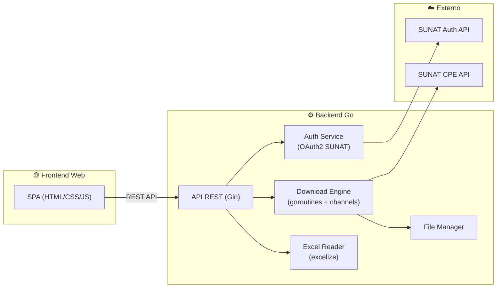

# Plan de Implementación — AppSireCPE en Go

## Descubrimiento: Proceso de Autenticación SUNAT

Se analizó completamente el flujo de obtención del token. Es un **OAuth2 Resource Owner Password Grant**:

### Endpoint de Token
```
POST https://api-seguridad.sunat.gob.pe/v1/clientessol/{clientId}/oauth2/token/
Content-Type: application/x-www-form-urlencoded
```

### Parámetros (form-urlencoded)
| Parámetro | Valor |
|-----------|-------|
| `grant_type` | `password` |
| `scope` | `https://api-cpe.sunat.gob.pe/` |
| `client_id` | `{clientId}` (API ID de SUNAT) |
| `client_secret` | `{clientSecret}` (API Clave de SUNAT) |
| `username` | `{RUC}{UsuarioSOL}` (concatenados, ej: `20123456789MODDATOS`) |
| `password` | `{ClaveSOL}` |

### Respuesta exitosa (HTTP 200)
```json
{
  "access_token": "eyJhbGciOiJSUzI1NiIs...",
  "token_type": "Bearer",
  "expires_in": 3600
}
```

### Credenciales necesarias por empresa
| Campo | Descripción |
|-------|-------------|
| `Ruc` | RUC de la empresa (11 dígitos) |
| `UsuarioSol` | Usuario SOL de SUNAT (ej: `MODDATOS`) |
| `ClaveSol` | Clave SOL |
| `ClientId` | API ID (se obtiene de SOL → Empresas → Credenciales API) |
| `ClientSecret` | API Clave (secreto de la aplicación registrada en SUNAT) |

> [!IMPORTANT]  
> El token es un **JWT** con un campo `exp` (expiración UNIX) y `numRUC`/`ruc` en el payload. La app original lo renueva automáticamente cuando faltan menos de **300 segundos** para que expire.

---

## Arquitectura Propuesta



---

## Estructura del Proyecto Go

```
sunat-cpe-downloader/
├── cmd/
│   └── server/
│       └── main.go                 # Punto de entrada del servidor
├── internal/
│   ├── auth/
│   │   ├── token.go                # Obtención de token OAuth2
│   │   ├── token_cache.go          # Caché de tokens por RUC (con expiración)
│   │   └── jwt.go                  # Parseo del JWT (payload, exp, ruc)
│   ├── sunat/
│   │   ├── client.go               # Cliente HTTP para SUNAT API
│   │   ├── downloader_pdf.go       # Descarga de PDFs
│   │   ├── downloader_xml.go       # Descarga de XMLs (con fallback)
│   │   ├── downloader_cdr.go       # Descarga de CDRs
│   │   ├── response.go             # Parseo de respuesta JSON (nomArchivo/valArchivo)
│   │   └── retry.go                # Lógica de reintentos con backoff exponencial
│   ├── engine/
│   │   ├── batch.go                # Motor de descarga masiva (worker pool)
│   │   ├── job.go                  # Definición de trabajo individual
│   │   └── result.go               # Resultado por comprobante
│   ├── excel/
│   │   ├── reader.go               # Lectura de archivos .xlsx
│   │   └── column_map.go           # Mapeo de columnas por tipo de hoja
│   ├── filemanager/
│   │   ├── paths.go                # Generación de rutas de carpetas
│   │   ├── zip.go                  # Extracción de ZIP
│   │   └── index.go                # Indexar archivos ya descargados
│   ├── api/
│   │   ├── router.go               # Definición de rutas REST
│   │   ├── handler_auth.go         # POST /api/auth/token
│   │   ├── handler_upload.go       # POST /api/upload (subir Excel)
│   │   ├── handler_download.go     # POST /api/download (iniciar descarga masiva)
│   │   ├── handler_status.go       # GET  /api/download/:id/status (progreso)
│   │   ├── handler_empresas.go     # CRUD de empresas
│   │   └── middleware.go           # CORS, logging, etc.
│   └── models/
│       ├── empresa.go              # Modelo de empresa con credenciales
│       ├── comprobante.go          # Modelo de comprobante (RUC, tipo, serie, numero)
│       └── download_job.go         # Estado de un trabajo de descarga
├── web/
│   ├── index.html                  # Frontend SPA
│   ├── css/
│   └── js/
├── go.mod
├── go.sum
└── README.md
```

---

## Componentes Principales

### 1. Autenticación (`internal/auth/token.go`)
```go
// Flujo:
// 1. POST a https://api-seguridad.sunat.gob.pe/v1/clientessol/{clientId}/oauth2/token/
// 2. Body: grant_type=password&scope=...&client_id=...&client_secret=...&username={ruc+usuario}&password={clave}
// 3. Parsear JSON → access_token
// 4. Cachear token con TTL basado en exp del JWT (menos 300s de margen)
```

### 2. Motor de Descarga (`internal/engine/batch.go`)
```go
// Flujo:
// 1. Recibir lista de comprobantes desde Excel o API
// 2. Crear worker pool con 6 goroutines
// 3. Cada worker descarga un comprobante llamando al downloader apropiado (PDF/XML/CDR)
// 4. Reintentos con backoff exponencial: delay = min(12s, 500ms * 2^(intento-1)) + jitter
// 5. Si 401 → renovar token automáticamente → reintentar
// 6. Hasta 3 barridos adicionales para errores transitorios
// 7. Reportar progreso via channel o WebSocket
```

### 3. Descargadores (`internal/sunat/downloader_*.go`)

| Componente | URL SUNAT | Formato salida |
|------------|-----------|----------------|
| **PDF** | `.../consultacpe/comprobantes/{id}-{libro}/01` | `.pdf` (extraído de ZIP o directo) |
| **XML** | `.../consultacpe/comprobantes/{id}-{libro}/02` → fallback: `.../controlcpe/consultaxml/{id}` | `.zip` |
| **CDR** | `.../consultacpe/comprobantes/{id}-{libro}/03` | `.zip` |

### 4. Lector de Excel (`internal/excel/reader.go`)
```go
// Usa github.com/xuri/excelize/v2
// 1. Detectar tipo de hoja (cpe, rvie, liqcom, rxh, ret, per)
// 2. Leer RUC (E2), Razón Social (E1), Periodo (K6)
// 3. Leer datos fila por fila desde fila 8 usando el mapeo de columnas correcto
// 4. Retornar []Comprobante
```

### 5. API REST Endpoints

| Método | Ruta | Descripción |
|--------|------|-------------|
| `POST` | `/api/empresas` | Registrar empresa con credenciales SOL + API |
| `GET` | `/api/empresas` | Listar empresas registradas |
| `POST` | `/api/auth/token` | Generar token para una empresa |
| `POST` | `/api/upload` | Subir archivo Excel (.xlsx) |
| `POST` | `/api/download/start` | Iniciar descarga masiva (PDF, XML, CDR) |
| `GET` | `/api/download/:id/status` | Consultar progreso (SSE o WebSocket) |
| `GET` | `/api/download/:id/files` | Listar archivos descargados |
| `GET` | `/api/files/:path` | Descargar un archivo individual |

---

## Dependencias Go Recomendadas

| Paquete | Uso |
|---------|-----|
| `github.com/gin-gonic/gin` | Framework HTTP para la API REST |
| `github.com/xuri/excelize/v2` | Lectura/escritura de archivos Excel .xlsx |
| `github.com/golang-jwt/jwt/v5` | Parseo del JWT de SUNAT |
| `github.com/google/uuid` | IDs únicos para jobs de descarga |
| `golang.org/x/sync/semaphore` | Control de concurrencia (worker pool) |
| `github.com/mattn/go-sqlite3` | Base de datos local para empresas |

---

## Equivalencias C# → Go

| C# (AppSireCPE) | Go |
|------------------|-----|
| `SemaphoreSlim(6)` | `semaphore.NewWeighted(6)` o buffered channel |
| `Task.WhenAll(...)` | `sync.WaitGroup` + goroutines |
| `ConcurrentBag<T>` | `sync.Mutex` + slice, o channel |
| `Interlocked.Increment` | `atomic.AddInt64` |
| `MSXML2.ServerXMLHTTP` | `net/http.Client` (mucho mejor) |
| `System.IO.Compression.ZipArchive` | `archive/zip` |
| `Convert.FromBase64String` | `encoding/base64.StdEncoding.DecodeString` |
| `Newtonsoft.Json` | `encoding/json` (stdlib) |
| `Microsoft.Office.Interop.Excel` | `excelize` (sin necesidad de Excel instalado) |

---

## Verificación

### Pruebas Automatizadas
- Test unitarios para parseo de JWT, respuesta JSON de SUNAT, backoff exponencial
- Test de integración para el flujo completo de autenticación (mock server)
- Test del motor de descarga con servidor SUNAT simulado

### Verificación Manual
- Subir un Excel real del AppSireCPE y verificar que lee las columnas correctamente
- Generar token real con credenciales SOL de prueba
- Descargar un lote pequeño (5-10 comprobantes) de PDF, XML y CDR
- Verificar estructura de carpetas y contenido de archivos descargados

---

## Open Questions

> [!IMPORTANT]
> **¿Deseas que las credenciales de las empresas se almacenen en una base de datos SQLite local, o prefieres otro mecanismo?**
> La app original usa una base de datos Access (.accdb). SQLite sería la alternativa natural en Go.

> [!IMPORTANT]
> **¿El frontend web necesita ser algo sofisticado (dashboard con gráficos de progreso, historial) o algo funcional y directo?**
> Esto afecta el alcance del desarrollo.

> [!WARNING]
> **Sobre las credenciales API (ClientId/ClientSecret):** La app original tiene un proceso automático donde inicia sesión en SOL con WebView2 para obtener estas credenciales. Replicar ese flujo en Go requeriría un headless browser (como chromedp). ¿Quieres que lo incluyamos o prefieres que el usuario ingrese manualmente ClientId y ClientSecret?
